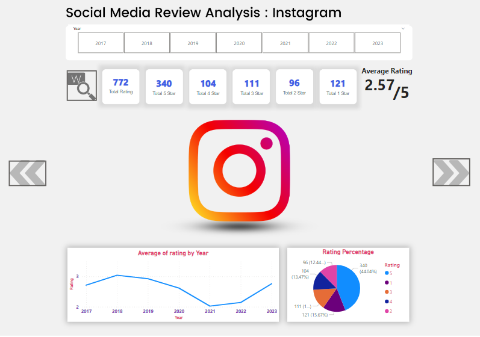
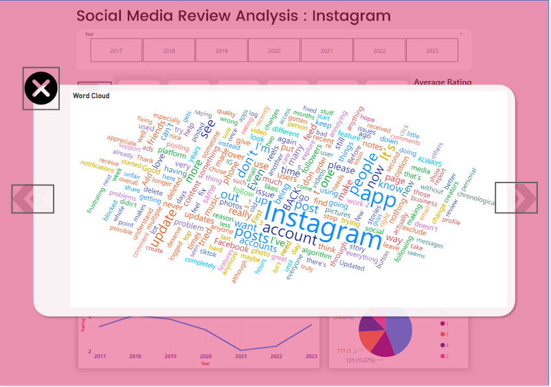
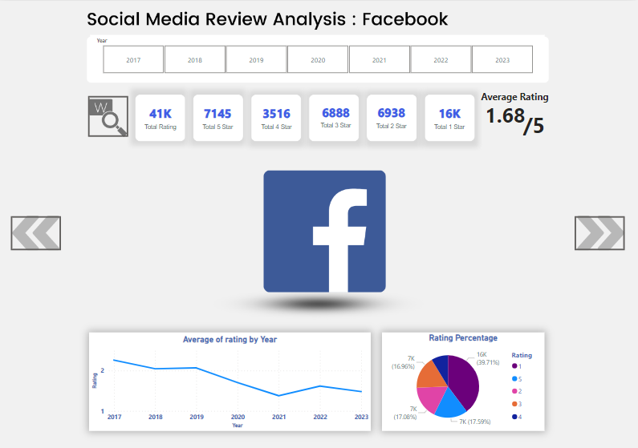
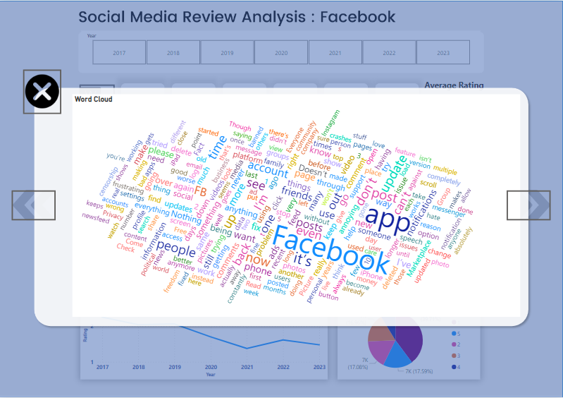
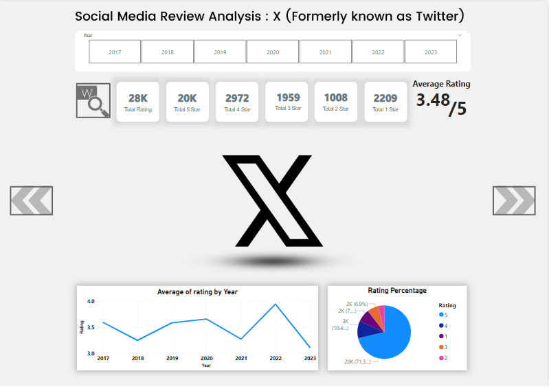
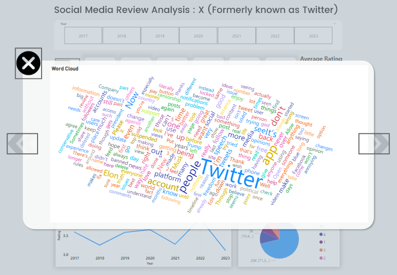
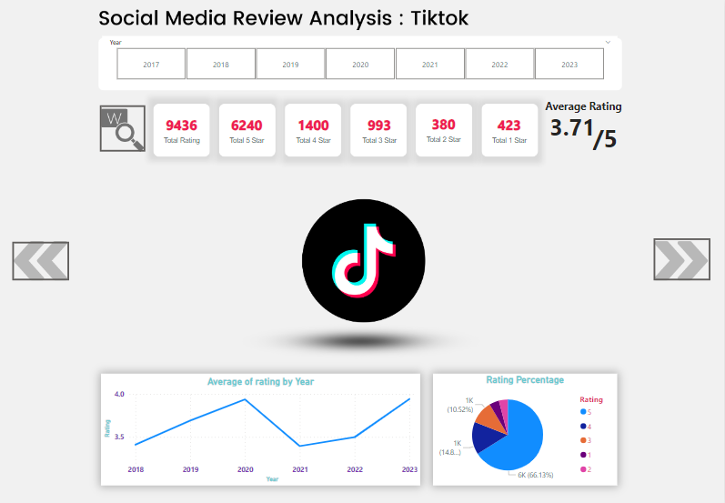
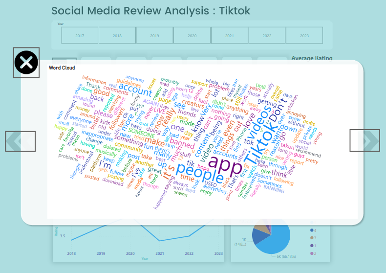

# USA APPLE APPS REVIEWS

Dataset used from [🏆Uber, FB, Waze, etc US Apple App Store Reviews](https://www.kaggle.com/datasets/bwandowando/uberm-fb-waze-etc-us-apple-app-store-reviews)
Data cleaning using Jupyter Notebooks

<table align="center">
<tr>
  <td></td>
  <td></td>
</tr>
<tr>
  <td></td>
  <td></td>
</tr>
<tr>
  <td></td>
  <td></td>
</tr>
<tr>
  <td></td>
  <td></td>
</tr>
</table>
